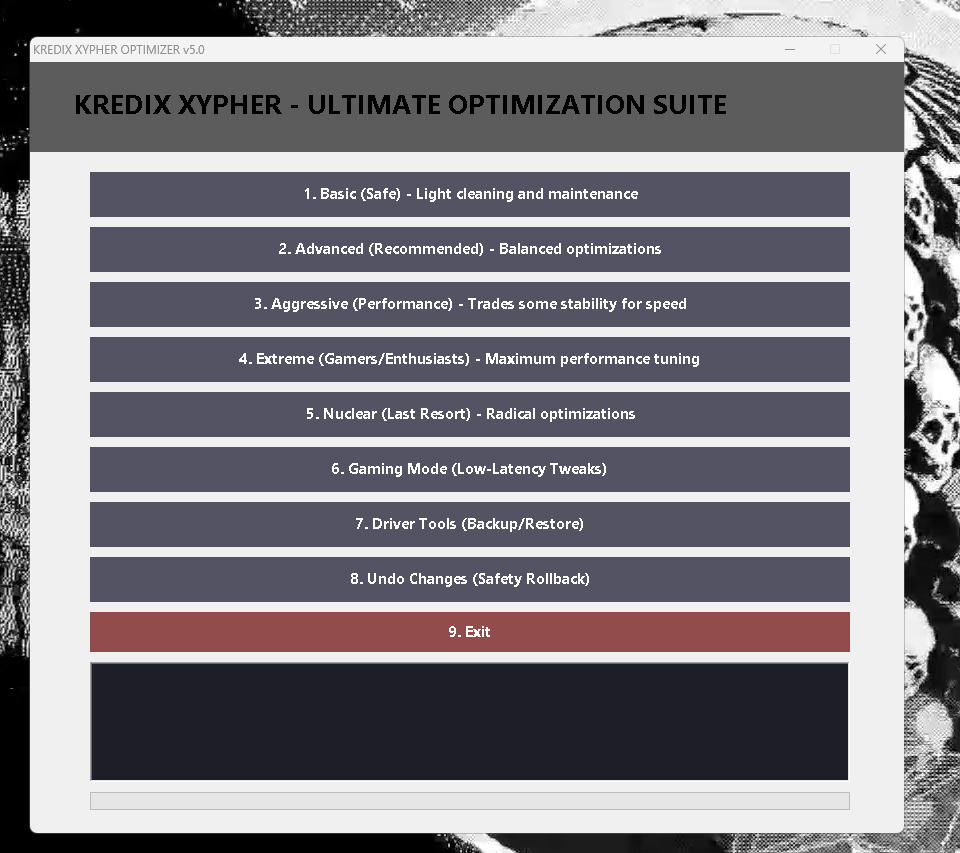

# **KREDIX XYPHER OPTIMIZER - User Guide**  
*(v5.0 | AI-Powered Windows Optimization)*  

  
*Fig 1. Main interface with optimization levels*

---

## **📌 Table of Contents**  
1. [System Requirements](#-system-requirements)  
2. [Installation](#-installation)  
3. [Interface Walkthrough](#-interface-walkthrough)  
4. [Optimization Modes](#-optimization-modes)  
5. [Advanced Features](#-advanced-features)  
6. [Troubleshooting](#-troubleshooting)  
7. [FAQ](#-faq)  

---

## **🖥️ System Requirements**  
| Component | Minimum | Recommended |  
|-----------|---------|-------------|  
| OS | Windows 10 1809+ | Windows 11 22H2 |  
| RAM | 4GB | 8GB+ |  
| Storage | 500MB free | 1GB+ free |  
| Privileges | Standard User | **Administrator** |  

---

## **📥 Installation**  
### **Method 1: Standard Install**  
1. Download `KredixXypher_Installer.exe` from [official site]  
2. Right-click → **Run as Administrator**  
3. Follow prompts (recommend default settings)  

### **Method 2: Portable Version**  
1. Extract `KredixXypher_Portable.zip`  
2. Run `Launcher.exe` as Admin  
3. No installation required  


---

## **🎨 Interface Walkthrough**  
### **Main Components**  
1. **Mode Selector** (Left Panel)  
   - Icons with risk indicators  
2. **Live Console** (Bottom)  
   - Real-time optimization logs  
3. **Progress Bar**  
   - Color-coded by operation type  
4. **Emergency Stop**  
   - Halts active optimizations  


---

## **⚙️ Optimization Modes**  
### **1. Basic (Safe) Mode**  
*What it does:*  
- Cleans temporary files  
- Optimizes startup items  
- Safe registry tweaks  

*Usage:*  
```powershell
.\optimizer.ps1 -Level 1
```

### **2. Advanced (Recommended) Mode**  
*What it does:*  
- All Basic optimizations +  
- Service optimization  
- Network tweaks  


*(See Appendix A for full mode comparisons)*  

---

## **🔧 Advanced Features**  
### **Driver Tools**  
1. Click **Driver Tools** button  
2. Select:  
   - `Backup` → Saves to `C:\Kredix\Drivers\`  
   - `Restore` → Rollback from backup  

### **Custom Profiles**  
1. Navigate to `Profiles > Save Current`  
2. Name your configuration  
3. Load later via `Profiles` menu  

---

## **🛠️ Troubleshooting**  
| Issue | Solution |  
|-------|----------|  
| "Access Denied" errors | Right-click → Run as Administrator |  
| Stuck at 20% progress | Disable AV temporarily |  
| Missing buttons | Set display scaling to 100% |  
| Rollback fails | Use System Restore point |  

**Emergency Recovery:**  
1. Boot to Safe Mode  
2. Run:  
```powershell
.\optimizer.ps1 -Level 8
```

---

## **❓ FAQ**  
**Q: Will this delete my files?**  
A: Only in Nuclear mode (Level 5). Always backup first.  

**Q: How long do optimizations take?**  
A: 2-15 minutes depending on mode and system speed.  

**Q: Can I cancel mid-optimization?**  
A: Yes via Emergency Stop button (may leave partial changes).  

---

## **📜 Appendix A: Mode Comparison**  
| Mode | Time | Changes Made | Reversible |  
|------|------|-------------|------------|  
| Basic | 2-5min | 15 tweaks | Fully |  
| Nuclear | 10-15min | 120+ tweaks | Partially |  

---

## **📜 Appendix B: Command Line Usage**  
```powershell
# Silent mode (no GUI)
.\optimizer.ps1 -Level 3 -Silent

# Custom profile
.\optimizer.ps1 -Profile "gaming.xml"
```

---

**📌 Pro Tip:** Combine **Advanced mode** (Level 2) with **Gaming mode** (Level 6) for ideal balance of speed and stability.  
